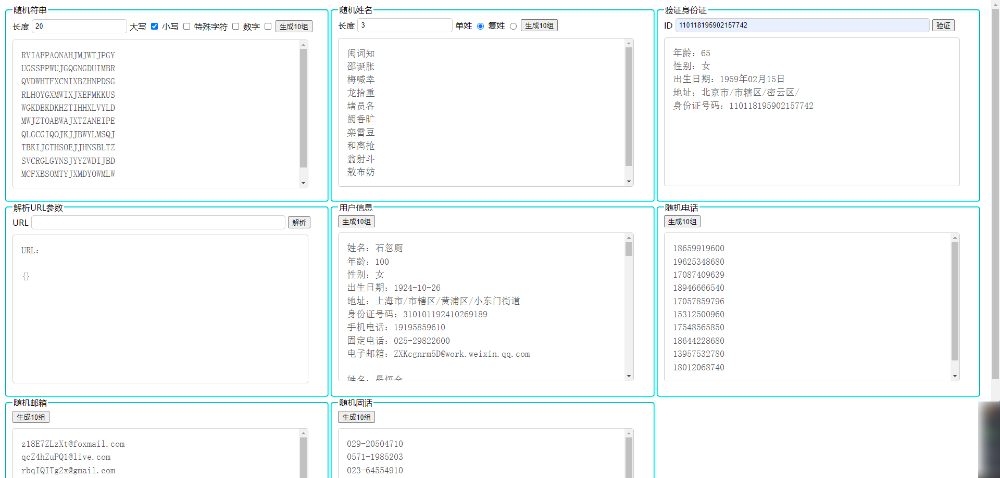

# 随机生成器

#### 介绍
随机信息生成器

#### 软件架构

html + css + js

#### 安装教程

直接浏览器打开就行

#### 安装教程

- [x] 随机字符串
- [x] 随机姓名
- [x] 验证身份证
- [x] 解析 URL 地址
- [x] 随机用户信息
- [x] 随机电话
- [x] 随机固话
- [x] 随机邮箱

#### 使用说明

访问 index.html 

[体验地址](https://systemmin.github.io/random/)

